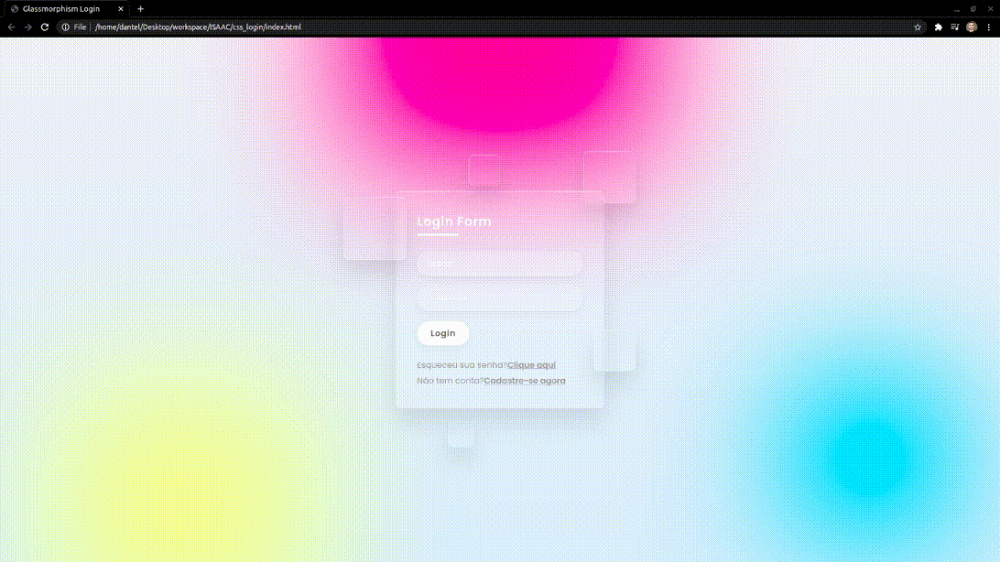
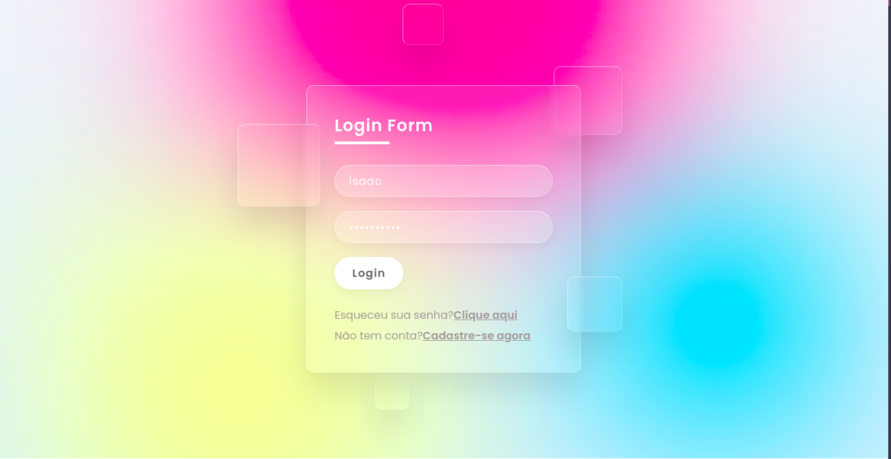

## Login Glassmorphism HTML + CSS
 

> Tela de login criada com HTML e CSS3 aplicando @Keyframes, sem javascript.

**Como baixar:**
Clone o repositório para sua máquina:

    git clone https://github.com/isaacwrk/login.glassmorphism.git
  
  **Agora abra o arquivo index.html**
  

